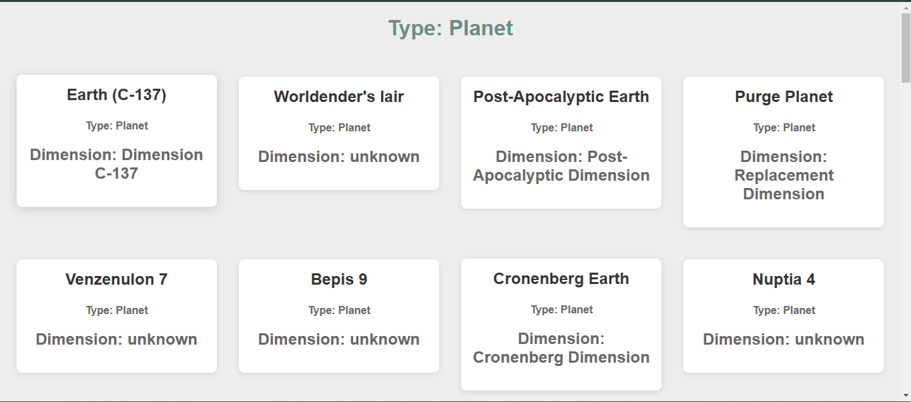

# Documentación Prueba técnica CELLS

## CELLS  📑

## Tabla de contenidos
- [Introducción](#introducción)
- [Requisitos del proyecto ](#requisitos-del-proyecto)
- [Especificaciones del sistema ](#especificaciones-del-sistema)
- [Supuestos ](#supuestos)
- [Configuraciones ](#configuraciones)
- [Autor ](#autor)

### Introducción
Este proyecto consiste en una página web que muestra información de ubicaciones de Rick & Morty utilizando una arquitectura basada en componentes. Incluye un componente padre que orquesta la visualización, un componente UI que renderiza la data en formato de tarjeta y un componente DM que obtiene los datos desde una API mediante fetch y los envía mediante eventos
        

### Requisitos del proyecto  
✅

- Página principal (componente padre)
  - Importar y orquestar los componentes hijos.
  - Alinear correctamente los elementos con CSS.
- Componente UI
  - Recibir y mostrar los datos proporcionados por el componente DM.
  - Renderizar un componente por cada objeto en el array de datos.
  - Mostrar las propiedades: Tipo, Dimensión y Nombre
  - Manejar casos de datos nulos o vacíos para evitar errores.
  - Diseñar el componente con estilo de card usando CSS.
  - Utilizar classMap de LitElement.
- Componente DM
  - Obtener datos desde la API de Locations Rick & Morty con fetch.
  - Utilizar async/await para la petición.
  - Emitir un evento con los datos obtenidos. 
  

### Especificaciones del sistema  
💻

- especificaciones
    - JavaScript , HTML, CSS
    - Visual Studio Code
    - Node
    - Lit Snippets
    - Contenedor proporcionado en clase

### Supuestos 

- se modifico el index la consigna no decia nada del index pero la modifique oara darle mas identidad al proyecto
   

### Configuraciones 
##  **⚙️**

- Ejecucucion del programa
    - si tienes instalado npm y lit
    - npm start funcionara 

- Capturas
  - Inicio 

 
  - Personajes

 
 - lugares

 
      
        
  

### Autor 
👨‍💻
***José Luis Ruiz Chavez***   

*JVB01SM*
